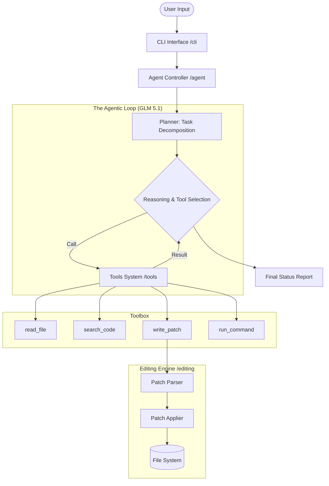

CodeFix Agent: The Autonomous Developer for Your Terminal

CodeFix is a developer-grade AI coding assistant that lives in your terminal. Unlike simple chat bots, CodeFix **reads** your codebase, **plans** complex modifications, **writes** code to disk, **runs** shell commands, and **autonomously debugs** issues until they are resolved.

Powered by **GLM 5.1**, CodeFix excels at long-range reasoning and precise tool utilization, making it an essential companion for modern software engineering.

Demo Vedio Link：https://youtu.be/Hj-fe3Fcx5s
---

##  See CodeFix in Action
> **Scenario**: Fixing a crashing GUI game with zero manual code interventions.

1. **Observe**: The user runs the game; it crashes.
2. **Command**: `/fix "Fix the crash in snake_game.py" --test "python3 snake_game.py"`
3. **Reasoning (GLM 5.1)**:
    - Agent reads `snake_game.py`.
    - Detects it's a GUI app; injects a `crash_logger` wrapper.
    - Runs the game with a timeout.
    - Reads the generated `crash.log`.
    - Identifies a `NameError: name 'pygame' is not defined`.
4. **Action**: Agent applies a patch adding `import pygame`.
5. **Verify**: Agent re-runs the test. It passes. Execution stops.

---

##  Why GLM 5.1?

ProAct is specifically tuned to leverage the **GLM 5.1** architecture for:
- **Hierarchical Planning**: Breaking down high-level requests (e.g., "Add an auth layer") into discrete file-editing and terminal-testing steps.
- **Surgical Code Edits**: Using GLM's high contextual precision to generate search/replace patches that respect indentation and local variable scope.
- **Recursive Debugging**: The model analyzes terminal stack traces and recursively applies fixes, observing the delta after each change.

---

##  System Architecture



---

##  Real-World Use Cases

**Who is this for?**
- **Feature Prototypers**: Rapidly iterate on functionality without leaving the terminal.
- **Maintenance Engineers**: Automatically fix unit tests or refactor legacy modules.
- **UI/Game Developers**: Use the "Autonomous Fix Mode" to capture and resolve errors in graphical apps that usually require manual debugging.

**What problem does it solve?**
It bridges the gap between "AI chat" and "AI work." Instead of copy-pasting code from a web browser, the agent operates directly on your files, ensuring that the code it generates actually runs and passes your specific test suite.

---

##  Project Structure

- **`cli/`**: Rich terminal interface with streaming output.
- **`agent/`**: Core controller orchestrating GLM 5.1 and the tool registry.
- **`tools/`**: Atomic operations for disk and shell access.
- **`context/`**: Codebase indexing and repository mapping for zero-shot awareness.
- **`editing/`**: The robust SEARCH/REPLACE patch engine for safe file modification.

---

##  Getting Started

### 1. Prerequisites
- Python 3.10+
- An OpenAI or OpenRouter API key (supporting GLM 5.1).

### 2. Setup
```bash
# Clone the repository
git clone <your-repo-url>
cd proact-agent

# Install dependencies
pip install -r requirements.txt

# Configure environment
cp .env.example .env
# Edit .env and set your OPENAI_API_KEY and MODEL_NAME=glm-5
```

### 3. Usage
```bash
python3 -m cli.main
```

**Commands:**
| Command | Description |
| :--- | :--- |
| `/map` | Visualize the current project structure. |
| `/clear` | Reset conversation history. |
| `/fix [task] --test [cmd]` | Enter autonomous repair mode. |

---

##  License
© 2026 CodeFix Team
